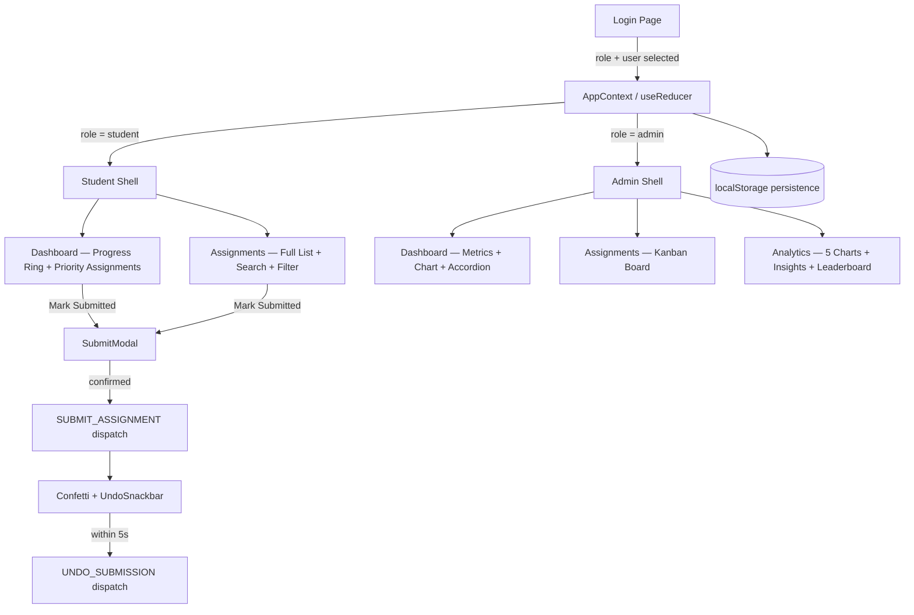
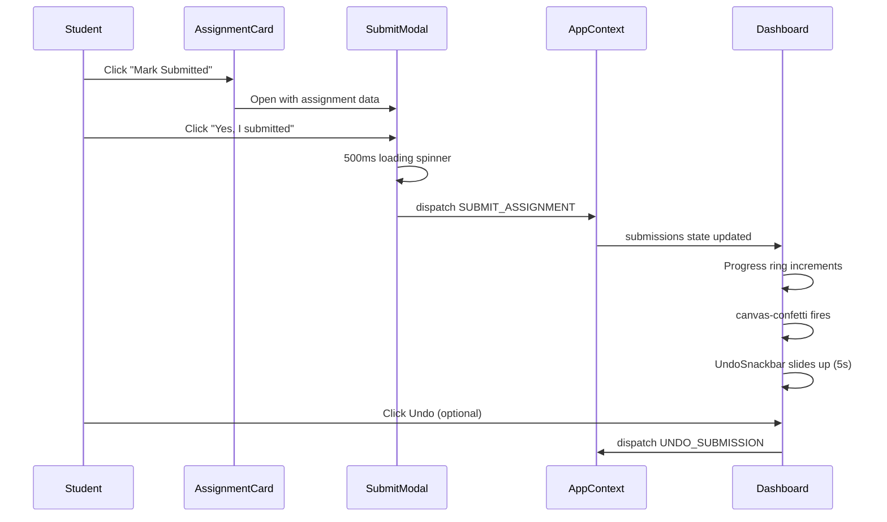
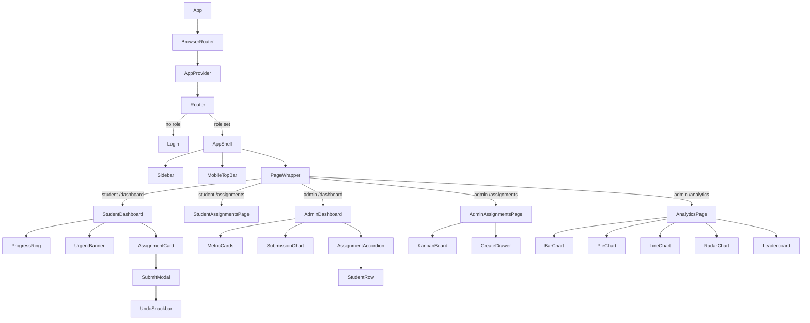

# EduTrack
> **Assignment management for students and professors — two roles, two experiences, one coherent system.**

[](https://reactjs.org/)
[](https://vitejs.dev/)
[](https://tailwindcss.com/)
[](https://www.framer.com/motion/)
[](https://greensock.com/gsap/)

### ➡️ Live Demo

**Deployed Link:**
https://edutrack-dashboard.netlify.app

---

## ➡️ Overview

EduTrack is an assignment management platform for students and 
professors. Professors create assignments with Drive links, monitor 
who has submitted and who hasn't, and get analytics on class 
performance. Students see exactly what's due, confirm their 
submissions through a verified flow, and track their progress 
in real time.

Built as a complete frontend system — role-based routing, animated 
dashboards, a five-chart analytics suite, kanban assignment management, 
and a full design system — using React, GSAP, Framer Motion, and 
Recharts.

### Why this stands out

- Role-based routing — students and professors see completely different UIs
- GSAP-animated SVG progress ring + number count-up on every dashboard load
- Double-verification submission flow with canvas-confetti + undo snackbar
- Kanban board for admin assignment management (Active / Due Soon / Overdue columns)
- 5-chart analytics page with actionable insights and student leaderboard
- Skeleton loading states, debounced search, multi-filter, dark mode — all wired
- Zero backend — pure React Context + useReducer + localStorage persistence

---

## ➡️ Architecture

### State Flow


### Submission Flow


### Component Tree


---

## ➡️ Key Features

### Student Role

| Feature | Detail |
|---|---|
| Progress Ring | GSAP SVG stroke-dashoffset animation, 1.2s power2.out |
| Count-up Stats | GSAP textContent tween — Total, Submitted, Overdue |
| Urgent Banner | Coral alert when any assignment due within 24h |
| Priority Dashboard | Shows overdue → due soon → pending, max 4 cards |
| Full Assignments Page | Debounced search (300ms) + status + subject filters |
| Submission Flow | Card → Modal (scale in) → Spinner → Confetti → Undo |
| Undo Snackbar | Slides up, 5s countdown bar, reverses submission |
| Skeleton Loading | 400ms simulated fetch, shimmer cards match real dimensions |

### Admin Role

| Feature | Detail |
|---|---|
| Metric Cards | Assignments, submission rate, overdue — GSAP count-up |
| Kanban Board | 3 columns — Active, Due Soon, Overdue — per assignment |
| Student Expand | Click any Kanban card to see per-student submission status |
| Create Assignment | Slide-in drawer, full validation, 2-step confirm before publish |
| Delete Assignment | With confirmation, cascades to remove submissions |
| CSV Export | UTF-8 BOM encoded, per assignment, downloads instantly |
| Accordion List | Dashboard view with progress bars and per-student rows |

### Analytics Page (Admin)

| Chart | What it shows |
|---|---|
| Bar chart | Submission rate per assignment — colour coded green/yellow/red |
| Donut chart | Overall submitted vs pending split |
| Line chart | Submission activity over last 14 days |
| Radar chart | Subject-level performance comparison |
| Leaderboard | All students ranked by submissions, At Risk badges |
| Insight cards | Actionable text — lowest subject, at-risk students, top performer |

---

## ➡️ Tech Stack

| Layer | Technology | Why |
|---|---|---|
| Framework | React 18 + Vite | Hooks, Context, sub-second HMR |
| Styling | Tailwind CSS v3 | Custom design tokens, dark mode via class |
| UI Animation | Framer Motion 11 | Layout, presence, stagger, gestures |
| SVG / Counters | GSAP 3 | stroke-dashoffset ring draw + number tweens |
| Charts | Recharts | Bar, Line, Pie, Radar — palette matched |
| Confetti | canvas-confetti | 14kb, palette-locked colours |
| Icons | Lucide React | 20px, stroke 1.5, never filled |
| Dates | date-fns | formatDistanceToNow, isPast, differenceInHours |
| Routing | React Router v6 | URL-based navigation, role-gated routes |

---

## ➡️ Design System

| Token | Value | Usage |
|---|---|---|
| `cream` | `#F5F2EA` | Page background |
| `ink` | `#1A1A14` | Sidebar, headings |
| `forest` | `#2D6A4F` | Primary CTA |
| `forest-mid` | `#52B788` | Progress, submitted state |
| `gold` | `#E9C46A` | Admin CTA, pending badge |
| `coral` | `#E63946` | Overdue only — never decorative |

**Typography:** DM Serif Display · DM Sans · DM Mono — all Google Fonts, same family

**Rules:** 1px borders only · no box shadows · depth via background contrast · coral is signal-only

---

## ➡️ Project Structure
```
src/
├── main.jsx
├── App.jsx                          ← BrowserRouter + role-gated routes
├── index.css                        ← Design tokens + skeleton shimmer
├── context/
│   └── AppContext.jsx               ← useReducer — single source of truth
├── data/
│   ├── students.js                  ← 8 students + 3 professors
│   ├── assignments.js               ← 10 assignments, relative due dates
│   └── submissions.js               ← Pre-seeded so dashboard isn't empty
├── hooks/
│   ├── useSearch.js                 ← Debounced search + multi-filter
│   ├── useLocalStorage.js           ← Generic localStorage hook
│   └── useCountUp.js                ← GSAP number tween hook
├── utils/
│   ├── dates.js                     ← isOverdue, isDueSoon, formatDeadline
│   ├── confetti.js                  ← Palette-locked confetti config
│   └── csvExport.js                 ← UTF-8 BOM Blob CSV generator
├── pages/
│   ├── Login.jsx                    ← Two-card role selector
│   ├── StudentDashboard.jsx         ← Overview: ring, stats, priority cards
│   ├── StudentAssignmentsPage.jsx   ← Full list: search, filter, submit
│   ├── AdminDashboard.jsx           ← Metrics, chart, accordion
│   ├── AdminAssignmentsPage.jsx     ← Kanban: Active / Due Soon / Overdue
│   └── AnalyticsPage.jsx           ← 5 charts + insights + leaderboard
└── components/
    ├── layout/
    │   ├── Sidebar.jsx              ← Desktop sidebar + mobile drawer
    │   ├── MobileTopBar.jsx         ← Hamburger + page title
    │   └── PageWrapper.jsx          ← Framer Motion page transition
    ├── ui/
    │   ├── Badge.jsx                ← Submitted / Pending / Overdue / Soon
    │   ├── ProgressRing.jsx         ← GSAP SVG ring
    │   ├── SearchBar.jsx            ← Debounced input + clear button
    │   ├── Skeleton.jsx             ← Shimmer card + ring skeletons
    │   └── EmptyState.jsx           ← Italic serif copy, never a blank div
    ├── assignments/
    │   ├── AssignmentCard.jsx       ← Card with stripe, tags, submit CTA
    │   ├── FilterBar.jsx            ← Status + subject pill filters
    │   └── UrgentBanner.jsx         ← Coral banner for 24h deadlines
    ├── submission/
    │   ├── SubmitModal.jsx          ← 2-step confirm modal
    │   └── UndoSnackbar.jsx         ← Slide-up with countdown bar
    ├── admin/
    │   ├── AssignmentAccordion.jsx  ← Expandable list with progress bars
    │   ├── StudentRow.jsx           ← Per-student submission status row
    │   └── CreateDrawer.jsx         ← Slide-in form with validation
    └── charts/
        └── SubmissionChart.jsx      ← Recharts bar chart component
```

---

## ➡️ Getting Started

### Prerequisites

- Node.js 18+
- npm 9+

### Installation
```bash
# 1. Clone the repo
git clone https://github.com/asthasingh0660/edutrack.git
cd edutrack

# 2. Install dependencies
npm install

# 3. Run dev server
npm run dev
```

Open `http://localhost:5173`

### Login

No credentials needed — pick a role and select a user from the list.

**Student accounts:** Aarav Mehta, Priya Sharma, Rohan Iyer, Sneha Patil, Karan Desai, Meera Nair, Dev Joshi, Ananya Bose

**Professor accounts:** Dr. Vikram Rao (Maths), Dr. Sunita Menon (Physics), Dr. Arjun Das (Literature)

### Build for production
```bash
npm run build
```

Output goes to `dist/` — ready to deploy to Netlify, Vercel, or any static host.

---

## ➡️ Deployment — Netlify

### Option 1 — Drag and Drop (fastest)
```bash
npm run build
```

Go to [netlify.com/drop](https://app.netlify.com/drop) → drag the `dist/` folder → done.

### Option 2 — Netlify CLI
```bash
npm install -g netlify-cli
netlify login
npm run build
netlify deploy --prod --dir=dist
```

### Option 3 — Git Integration (recommended for live URL)

1. Push repo to GitHub (steps below)
2. Go to [app.netlify.com](https://app.netlify.com) → Add new site → Import from Git
3. Connect GitHub → select `edutrack` repo
4. Build settings:
   - **Build command:** `npm run build`
   - **Publish directory:** `dist`
5. Click Deploy

**Important — add `_redirects` file** for React Router to work on Netlify.

Create `public/_redirects`:
```
/*    /index.html   200
```

Without this file, refreshing on any route other than `/` will give a 404.

---

## ➡️ GitHub — Push Steps
```bash
# 1. Inside your edutrack folder, initialise git
git init

# 2. Add all files
git add .

# 3. First commit
git commit -m "feat: initial EduTrack dashboard — student + admin role-based UI"

# 4. Create repo on GitHub
# Go to github.com/asthasingh0660 → New repository
# Name it: edutrack
# Keep it public, do NOT initialise with README (you already have one)

# 5. Connect and push
git remote add origin https://github.com/asthasingh0660/edutrack.git
git branch -M main
git push -u origin main
```

After this, every future change is just:
```bash
git add .
git commit -m "your message"
git push
```

And if you set up Netlify Git integration, it auto-deploys on every push.

---

## ➡️ Demo Credentials

| Role | Name | Subject |
|---|---|---|
| Student | Priya Sharma | Physics |
| Student | Aarav Mehta | Maths |
| Student | Rohan Iyer | Literature |
| Professor | Dr. Sunita Menon | Physics |
| Professor | Dr. Vikram Rao | Maths |
| Professor | Dr. Arjun Das | Literature |

Use **Reset Demo** in the sidebar to clear all submissions and start fresh.

---

## 📄 License

MIT